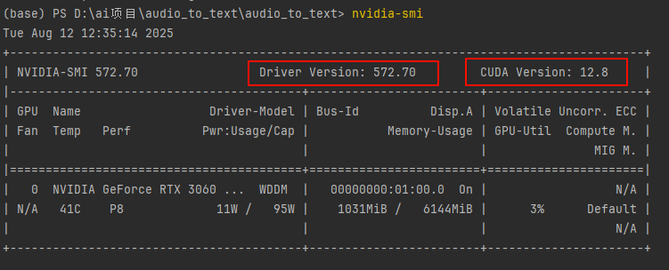
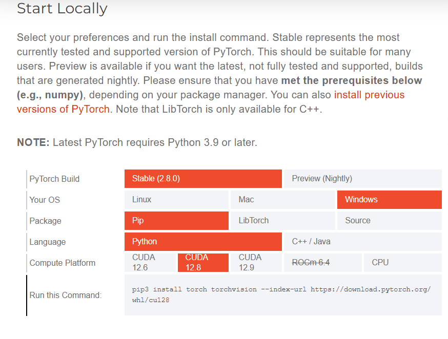
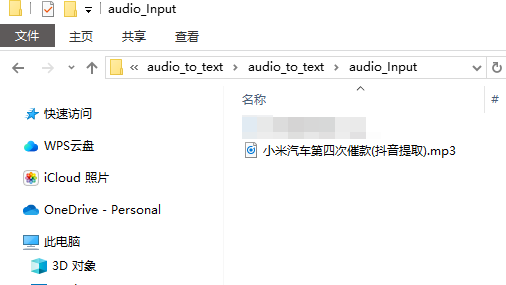
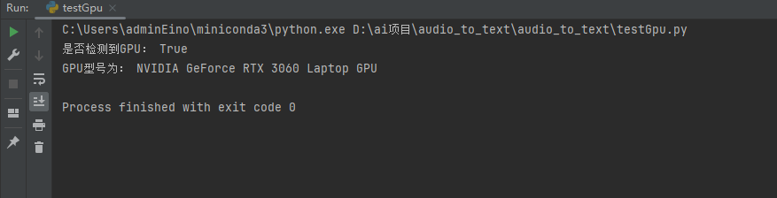
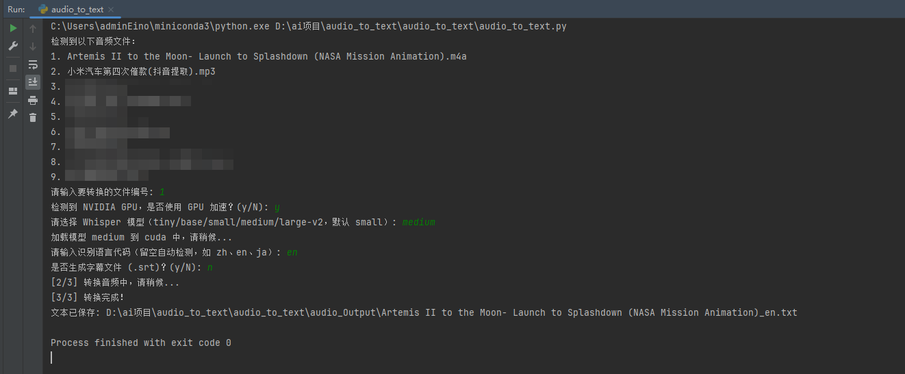
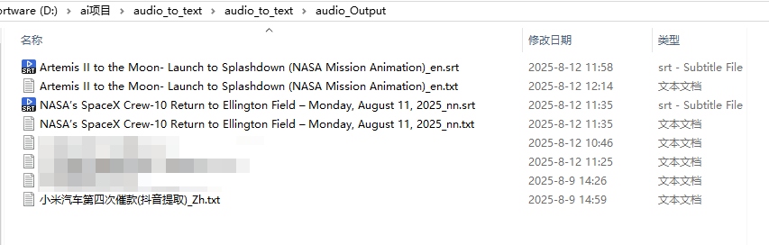
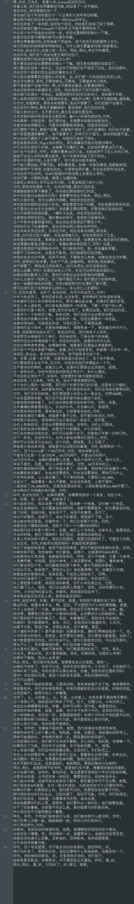
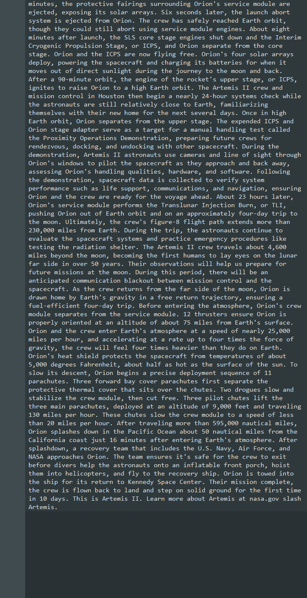

# 音频转文字与字幕生成工具

这是一个基于 Python 和 Whisper 的音频处理工具，能够将多种格式的音频文件转换为文本，并可选择生成字幕文件。工具设计简洁易用，自动处理文件路径，用户只需选择输入文件即可完成转换操作。

## 功能特点

- 支持多种音频格式：m4a、mp3、mp4、aac、wav、flac、ogg、wma、webm
- 自动处理文件路径，无需手动输入
- 可选择生成字幕文件
- 输出文件自动命名为原文件名+语言识别后缀

### Whisper 支持的主流语言代码及名称

| 语言代码 | 语言名称 |
|----------|----------|
| 'zh'     | 中文     |
| 'en'     | 英语     |
| 'ja'     | 日语     |
| 'ko'     | 韩语     |
| 'fr'     | 法语     |
| 'de'     | 德语     |
| 'es'     | 西班牙语 |
| 'ru'     | 俄语     |
| 'ar'     | 阿拉伯语 |
| 'pt'     | 葡萄牙语 |


### Whisper 可选模型参数（load_model 时使用）

| 模型名称  | 特点描述                                                                 |
|-----------|--------------------------------------------------------------------------|
| "tiny"    | 最快，精度最低，适合实时或低配机器（~75MB）                              |
| "base"    | 速度较快，精度一般（~142MB）                                             |
| "small"   | 平衡速度与精度（~466MB）                                                 |
| "medium"  | 较高精度，速度较慢（~1.5GB）                                             |
| "large"   | 最高精度，支持多语言（~2.9GB，需高性能GPU或耐心等待CPU）                 |
| "large-v2"| large的优化版本，精度更好（推荐离线使用）  

## 目录结构
```bash
project/
├── audio_Input/    # 存放待转换的音频文件
├── audio_Output/   # 转换结果输出目录
└── audio_to_text.py    # 主程序脚本
└── testGpu.py          # 测试当前环境是否满足使用GPU运行whsiper
```
## 依赖要求
- Python ≥ 3.8
- OpenAI Whisper
- Pytorch 

## 安装依赖
   ```bash
    pip install -U openai-whisper
    pip install torch --index-url https://download.pytorch.org/whl/cu118  //此版本为标准torch 若Cpu英伟达建议安装可以调用Gpu的Torch
   ```

### 支持`GPU`加速运行的Torch (**可选,非强制内容**，使用`CPU`不影响整体运行状态，只会降低整体处理速度)
1. 运行`testGpu.py`查看当前机型是否安装可使用GPU加速及具体的GPU型号 
    + 若检测结果为`True`并输出`GPU`型号可忽略本小结的内容。
2. 卸载当前安装的`Torch`
   ```bash
   conda uninstall pytorch torchvision torchaudio
   ```
4. 在终端使用`nvidia-smi`查看你的`CUDA`版本
    ```bash
   nvidia-smi
   
   ```
   
4. 前往 [PyTorch官网](https://pytorch.org/get-started/locally/),选择操作系统 （Windows）、包管理器 （Conda）、编程语言 （Python），以及 CUDA 版本。

   
5. 使用官网给出本机状态下的支持`GPU`加速的`Torch`链接，并在终端进行安装，示例如下：
```bash
conda install pytorch torchvision torchaudio pytorch-cuda=11.8 -c pytorch -c nvidia  //例,请结合网站给出的安装路径进行安装,不要拷贝粘贴本链接
```
---
### 创建目录（在脚本同级目录新建两个文件夹即`audio_Input`与`audio_Output`）
1. 将需要转换的音频文件放入 `audio_Input` 目录
2. 输出的文本及字幕文件将在此显示
3. 按照提示选择需要处理的音频文件
4. 选择是否生成字幕文件（默认不生成）
5. 处理结果将保存到 `audio_Output` 目录
```bash
audio_Input     # 存放要识别的音频文件
audio_Output    # 识别结果会输出到这里
```
## 运行脚本
   ```bash
   python audio_to_text.py
   ```

## 测试运行效果

<p align="center">放入输入音频</p>



<p align="center">检测GPU状态</p>




<p align="center">音频处理过程</p>



<p align="center">输出文件一览</p>



<p align="center">识别结果展示-中文</p>



<p align="center">识别结果展示-英文</p>

## 输出说明

- 文本文件：包含音频识别后的文字内容
- 字幕文件（可选）：支持常见字幕格式（如.srt）

## 注意事项

- 处理文件的时长与文件大小、当前机型的`CPU`，`GPU`参数及调用`Wisper`模型大小有关。
- 识别的`准确度`取决于音频质量和语言清晰度。
